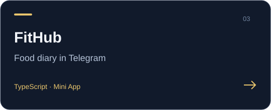

**[Open demo](https://fithub-virid.vercel.app)** · **Project documentation**

---

# 🥑 ИИ-нутрициолог — Telegram-бот + Mini App

Пришлите боту фото еды — он распознает блюда, посчитает калории и БЖУ, запишет в дневник и будет присылать персональные советы нутрициолога.

**Стек:** Node.js 22 · TypeScript · Fastify · grammY · Prisma · React + Vite (Telegram Mini App) · два ИИ-провайдера: OpenRouter/Qwen (vision) + DeepSeek (text) · Telegram Stars.
**Хостинг:** Vercel (статика Mini App + serverless-функции API/бота + Vercel Cron) · Supabase (PostgreSQL).

## Возможности

- 📸 **Фото → КБЖУ**: vision-модель определяет блюда и порции, карточка с итогами и прогрессом дня приходит ответом на фото. Подпись к фото — подсказка модели (название берётся из неё).
- ✏️ **Уточнение ответом**: ответьте на карточку («это была индейка, 200 г») — бот пересчитает запись.
- 💬 **Текст → КБЖУ**: «тарелка борща и два куска хлеба» — тот же результат.
- 📱 **Mini App**: онбординг с расчётом норм (Миффлин-Сан Жеор), «Сегодня» с кольцами прогресса, правка граммов слайдером (КБЖУ пересчитываются пропорционально), аналитика с графиками и стриком, настройки нутрициолога, подписка.
- 🤖 **Советы**: ежедневный совет в выбранное время с учётом статистики за 7 дней и паттернов (пропуски завтрака, поздние ужины), тон — строгий/дружелюбный/научный. Месячный отчёт для Pro.
- ⭐ **Монетизация**: Telegram Stars. Free — 3 распознавания в день, советы 2 раза в неделю, аналитика за неделю. Pro — безлимит, ежедневные советы, месячная аналитика и отчёты.
- 🛡 **Админка** (вкладка в Mini App для `ADMIN_TG_IDS`): расходы на ИИ в ₽ (сводка за сегодня/30 дней, график по дням, по моделям и по каждому пользователю), выдача/снятие Pro, персональные лимиты, рассылка анонсов всем пользователям.

## Как получить токены

| Переменная | Где взять |
|---|---|
| `BOT_TOKEN` | В Telegram у [@BotFather](https://t.me/BotFather): `/newbot` → скопировать токен. |
| `VISION_API_KEY` | [openrouter.ai/keys](https://openrouter.ai/keys) — ключ vision-провайдера (распознавание фото, Qwen VL). |
| `TEXT_API_KEY` | [platform.deepseek.com/api_keys](https://platform.deepseek.com/api_keys) — ключ text-провайдера (советы, отчёты, еда текстом). |
| `DATABASE_URL` | Supabase → проект → **Connect** → *Transaction pooler* (порт **6543**). Добавьте в конец `?pgbouncer=true&connection_limit=1`. |
| `DIRECT_URL` | Там же → *Direct connection* (порт **5432**) — используется только миграциями Prisma. |
| `WEBAPP_URL` | URL проекта на Vercel, например `https://nutri-ai.vercel.app`. |

S3 настраивать **не нужно**: фото хранятся как Telegram `file_id`, превью в Mini App отдаёт backend-прокси (`GET /api/photos/:mealId`, кэш `file_path` 30 минут). При желании можно подключить Supabase Storage / R2 через переменные `S3_*`.

## Деплой: Supabase + Vercel

1. **Supabase**: создайте проект → скопируйте обе строки подключения (см. таблицу выше).
2. **Миграции** (локально, один раз на каждую новую миграцию):
   ```bash
   pnpm install
   DATABASE_URL=<direct-url> DIRECT_URL=<direct-url> pnpm --filter bot-api prisma:deploy
   ```
3. **Vercel**: импортируйте репозиторий (Framework: *Other*; настройки сборки уже в `vercel.json`). В **Environment Variables** задайте: `BOT_TOKEN`, `VISION_API_KEY`, `TEXT_API_KEY`, `DATABASE_URL` (pooled!), `DIRECT_URL`, `WEBAPP_URL`, `CRON_SECRET` (любая случайная строка) и при желании `TZ_DEFAULT`, цены/модели.
4. **Webhook бота** (после первого деплоя). Секрет вычисляется из `BOT_TOKEN`, поэтому проще всего:
   ```bash
   BOT_TOKEN=... WEBAPP_URL=https://<проект>.vercel.app node scripts/set-webhook.mjs
   ```
   Скрипт вызовет `setWebhook` на `WEBAPP_URL/api/tg-webhook` с secret_token и покажет ответ Telegram.
5. **Mini App**: у BotFather `/newapp` (или Bot Settings → Menu Button) → укажите `WEBAPP_URL`.
6. Проверка: `https://<проект>.vercel.app/health` → `{"ok":true}`, затем пришлите боту фото еды.

### Vercel Cron

`vercel.json` настроен под лимиты бесплатного плана (Hobby: максимум 2 cron-задачи, раз в день): советы — в 06:00 UTC (≈09:00 МСК), месячные отчёты + деактивация подписок — в 08:00 UTC. Vercel сам передаёт `Authorization: Bearer $CRON_SECRET`.

> 💡 Ограничение Hobby: совет уходит одной «волной» в день, поэтому пользователи с `adviceTime` позже ~09:00 МСК получат его на следующее утро. Чтобы советы приходили точно в выбранное время, дёргайте `GET /api/cron/advice` каждые 15 минут внешним планировщиком (бесплатный [cron-job.org](https://cron-job.org), заголовок `Authorization: Bearer <CRON_SECRET>`) — дублей не будет, повторная отправка за день исключена уникальным ключом. На Vercel Pro просто верните в `vercel.json` расписания `*/15 * * * *` (advice) и `0 * * * *` (monthly).

## Локальная разработка

```bash
pnpm install
cp .env.example .env        # заполнить секреты; DATABASE_URL можно указать локальный PostgreSQL
pnpm --filter bot-api prisma:migrate   # применить миграции (dev)
pnpm seed                   # тестовый пользователь + неделя фейковой еды
pnpm dev:api                # бот (long polling) + API на :3000 + cron в процессе
pnpm dev:webapp             # Mini App на :5173 (прокси /api → :3000)
```

Локально бот работает через **long polling** — публичный URL не нужен. Mini App в Telegram требует HTTPS: удобен туннель `cloudflared tunnel --url http://localhost:5173`.

Полезное:

```bash
pnpm test         # юнит-тесты: initData HMAC, нормы КБЖУ, пересчёт граммов, парсинг JSON, таймзоны
pnpm typecheck    # строгий TypeScript
pnpm lint         # ESLint, без any
SKIP_BOT_LAUNCH=1 pnpm dev:api          # только API, без подключения к Telegram
SEED_TG_USER_ID=<ваш tg id> pnpm seed   # сид на свой аккаунт — сразу видно аналитику и советы
```

### Как проверить ежедневный совет, не ожидая утра

Поставьте `adviceTime` на ближайшие минуты (в Mini App → Настройки, или SQL ниже) и дождитесь тика (≤15 минут) либо дёрните `GET /api/cron/advice` вручную:

```sql
UPDATE "Profile" SET "adviceTime" = to_char(now() at time zone 'Europe/Moscow', 'HH24:MI');
```

## Как поменять модели, провайдеров и цены

Всё через переменные окружения (на Vercel — Environment Variables, локально — `.env`), без пересборки кода. Провайдеры независимы: любой OpenAI-совместимый API подходит.

```
# Vision — ТОЛЬКО распознавание фото еды
VISION_BASE_URL=https://openrouter.ai/api/v1
VISION_API_KEY=...
VISION_MODEL=qwen/qwen3-vl-32b-instruct                  # основная vision-модель
VISION_MODEL_FALLBACK=qwen/qwen3-vl-235b-a22b-instruct   # повтор при confidence < 0.5

# Text — советы, отчёты, разбор еды текстом
TEXT_BASE_URL=https://api.deepseek.com/v1
TEXT_API_KEY=...
TEXT_MODEL=deepseek-chat

STARS_PRICE_MONTH=250     # цена Pro на месяц в Stars
STARS_PRICE_YEAR=1700     # цена Pro на год в Stars
FREE_PHOTOS_PER_DAY=3     # лимит распознаваний на free
```

При старте выполняется probe обоих провайдеров: если модель переименована или deprecated (DeepSeek периодически меняет `deepseek-chat` на имена вида `deepseek-v4-*`), приложение **не падает**, а пишет в лог подсказку с актуальными именами моделей для `TEXT_MODEL`/`VISION_MODEL`. При временной недоступности text-провайдера (5xx/таймаут) советы откладываются до следующего cron-тика, а разбор текстовых описаний еды автоматически уходит на vision-провайдера; фото всегда ходят только в vision.

## Стенд сравнения vision-моделей

Отдельная страница вне Telegram: `https://<проект>.vercel.app/api/bench`. Загружаете фото еды — оно по очереди уходит в выбранные модели, и по каждой видно распознанные блюда с граммами и КБЖУ, **фактическую** цену вызова (в $ и ₽) и время ответа. Внизу — итоги: кто дешевле, кто быстрее и каков разброс по калориям между моделями.

- Список моделей правится прямо на странице и запоминается в браузере; кнопка «Найти модели» показывает все модели провайдера с поддержкой картинок и их актуальными ценами — имена не нужно угадывать.
- Промпт и схема разбора те же, что в проде, — сравнение честное.
- Расходы пишутся в `AiUsage` с `purpose: "bench"` и не смешиваются с боевыми в админке.
- **Пароля нет — страница открыта всем.** Баланс защищает только дневной потолок расходов стенда: `apps/bot-api/src/features.ts` → `BENCH_DAILY_USD_LIMIT` (по умолчанию $1 ≈ 200 прогонов в сутки). Когда потолок достигнут, прогоны отвечают 429 до следующих суток; боевого распознавания это не касается. Страница закрыта от индексации (`noindex`), но любой, кому попадётся ссылка, может тратить эти деньги — потолок и есть цена такого удобства.

## Архитектура

```
api/index.ts      Vercel-функция: все /api/* и /health → Fastify-приложение
vercel.json       сборка Mini App, rewrites, functions, cron-расписания
apps/
  bot-api/        Fastify + grammY + Prisma (+ node-cron для локального dev)
    src/bot/      хендлеры бота, карточки КБЖУ, очередь, платежи Stars
    src/api/      REST для Mini App (JWT после валидации initData), webhook, cron-эндпоинты
    src/lib/ai.ts фабрика ИИ-клиентов: visionClient + textClient, probe, ретраи, деградация
    src/ai/       пайплайн распознавания еды (фото → vision, текст → text с деградацией)
    src/cron/     ежедневные советы, месячные отчёты, истечение подписок
    src/services/ нормы КБЖУ, приёмы пищи, статистика, лимиты, подписки
    prisma/       схема, миграции, seed
  webapp/         React + Vite Mini App (статика на Vercel)
```

Безопасность: единственный якорь идентичности — `tgUserId` из initData, проверенного HMAC-SHA256 (`secret = HMAC_SHA256(botToken, "WebAppData")`, TTL auth_date 24 ч). Подделанный initData получает 401. Сессия — JWT на 12 часов. Webhook Telegram защищён `secret_token`, cron-эндпоинты — `CRON_SECRET`.
